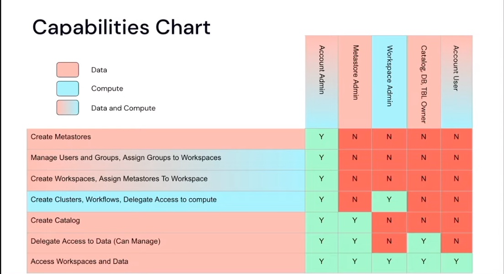
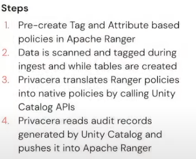
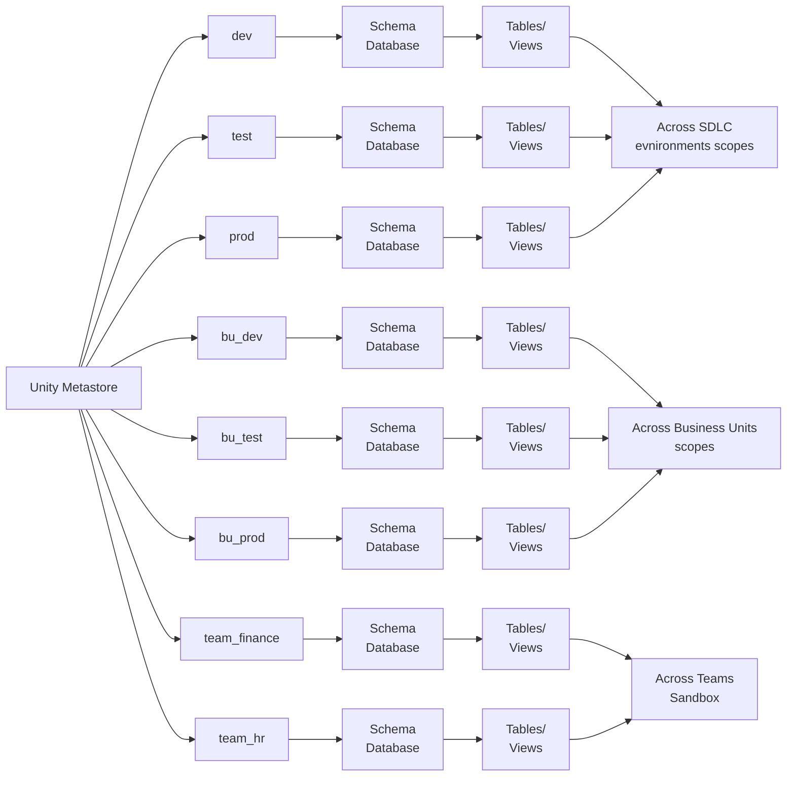

# Databricks Unity Catalog

## Topology: multi-region / multi-cloud UC
Powered by Delta Sharing
- Metastore boundary = region / cloud (due to latency, cost)
- Use single region Metastore for all SDLC scopes and business units
- Use Databricks-to-Databricks Delta Sharing between cloud regions and cloud providers

## Capability Chart

## Unity-enabled jobs
- Use SINGLE USER policy for JOB CLUSTERS
- Set a SERVICE PRINCIPAL as the OWNER of prod jobs and RUN as that SP NOTE: Workspace Admins can change job ownership and by extension access data that service principals of the workspace can access
- Limit Workspace Admin role to required Dev Ops or IT Ops groups only
- Use a dedicated service principal for each job
- Use a dedicated job cluster for each job

## Catalog / schema / table setup
The catalog level of the
- 3-level namespace allows to structure databases
- Tables / views according to technical or business needs.

